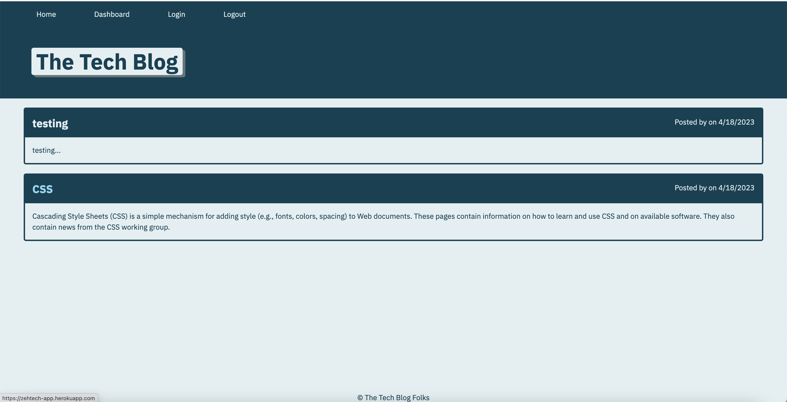

# Tech-Blog

## Description

This is CMS-style blog site that where developers can publish their blog posts
and comment on other developers post as well.

## Installation

git clone the repo to your local machine. To use this application, please run the following command:

npm install.

And then run the following commands to install the dependencies if you are not sure if they are up to date:

npm i inquirer

npm i sequelize

npm i dotenv

npm i express npm i express

## Usage
Type the following command in your termimal: mysql -u root -p -- connect to your database and then run:

source db/schema.sql

Quit mySQL shell. Run the following command to seed the files:

npm run seed

Then run:

npm start

    
  
https://github.com/ZDastan/tech-blog

https://zehtech-app.herokuapp.com/

